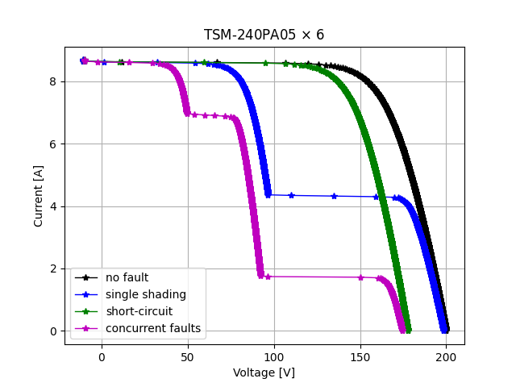
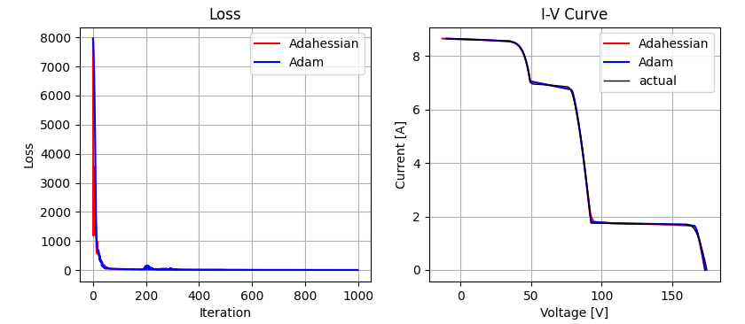

# Differentiable Fast Fault Simulation Model (DFFSM) for PV

<!-- 项目徽章 -->


> DFFSM is a differential physical simulator developed for photovoltaic (PV) string fault modeling and fault quantification. 


## Table of Contents
- [Installation](#installation)
- [Background](#background)
- [Fault modeling using DFFSM](#fault-modeling-using-dffsm)
- [Gradient-based fault parameters identification (GFPI) based on DFFSM](#gradient-based-fault-parameters-identification-gfpi-based-on-dffsm)
- [Citation](#citation)


## Installation
```bash
git clone https://github.com/Yuanliang-Li/dffsm.git
cd dffsm
python3 -m venv .venv
source .venv/bin/activate
pip install --upgrade pip
pip install --upgrade -r requirements.txt
```

## Background 
### DFFSM introduction
DFFSM is a differential physical simulator developed for PV string fault modeling and fault quantification.  It estimates the current-voltage characteristic curve (I-V curve) of a PV string under a certain fault condition (encoded by a fault vector), given the in-plane irradiance and cell temperature. 

A key property of DFFSM is its differentiability, which computes gradients of a predefined loss function with respect to the input.
Based on its differentiability, DFFSM can be used to identify the fault vector from a measured I-V curve using
gradient-based fault parameters identification (GFPI) method. 

DFFSM is implemented based on PyTorch using Python, which adopts PyTorch's autograd mechanism to automatically calculate the gradient, 
thereby making the implementation convenient and flexible.

### CFFSM vs. DFFSM
Before DFFSM, we have developed CFFSM (a code-based fast fault simulation model), which is a numerical simulator for PV fault modeling. 
CFFSM can simulate a set of faults occurred in a PV string under different solar irradiation and temperature conditions, 
including partial shading (PS), bypass diode short-circuit (BD-SC), bypass diode open-circuit (BD-OC), and degradation, with high computational efficiency.
CFFSM is based on I-V scanning mechanism and with cell-wise resolution. It scans the string current staring from 0 to the short-circuit current. In each iteration, it calculate the voltage of every PV cell first and performs voltage superposition to obtain the string voltage.
PV cells with the same irradiance and temperature will be computed once to reduce computations.

DFFSM is an advancement of CFFSM by adding the differentiability. 

The following table shows the comparison between CFFSM and DFFSM:

|Model|Input| Output |  Fault Types  | 5-Parameter Calculation Method | Voltage Solver       |Differentiable| Framework  |
|-----|------|------------------|---------------------|------------------------|----------------|------|------------|
|CFFSM|T-I, User-friendly Fault| I-V curve        | PS, BD-SC, BD-OC, DG | De Soto / CEC   | LambertW / Newton / Newton-RB |No| Python  Numpy |
|**DFFSM**|T-I, Current sequence, Fault Vector| Voltage sequence | PS, BD-SC, BD-OC, DG | De Soto / CEC  | LambertW-Newton-RB |Yes| Python  PyTorch |
------------------
where
- T-I: cell temperature and irradiance.
- PS: partial shading.
- BD-SC: bypass diode short-circuit.
- BD-OC: bypass diode open-circuit. 
- DG: degradation.
- LambertW: calculate voltage based on the explicit LambertW function under single-diode model (SDM).
- Newton: calculate voltage based on Newton method under single-diode model (SDM).
- Newton-RB: calculate voltage based on Newton method under reverse-biased single-diode model (RSDM).
- LambertW-Newton-RB: Use LambertW to calculate the initial guess of the voltage, then calculate voltage based on Newton method under RSDM.


## Fault modeling using DFFSM 
Given a fault vector `x`, cell temperature (`T`), irradiance (`S`), and a current sequence (`I`), DFFSM calculates the corresponding voltage sequence (`V`) for a PV string. This calculation is called "forward calculation" of DFFSM, as follows:

`V = DFFSM.forward(I, T, S, x)`

The fault vector is used to quantify concurrent faults, which is defined as: 

`x = [n_s1, n_c1, r_1, n_s2, n_c2, r_2, n_sc, d_oc1, d_oc2, Rc]`

- `n_s1` (int [`0~Nsub`]): number of sub-strings affected by shadow-1 (starting from first substring)
- `n_c1` (int [`0~Nsubc`]): number of PV cells in each substring affected by shadow-1 
- `r_1` (float [0~1]): shading ratio affected by shadow-1 (percent of lost irradiance), effective irradiance = S*(1-r_1)
- `n_s2` (int [`0~Nsub`]): number of sub-strings affected by shadow-2 (starting after the first shadow)
- `n_c2` (int [`0~Nsubc`]): number of PV cells in each substring affected by shadow-2
- `r_2` (float [0~1]): shading ratio affected by shadow-2 (comparison ration to r_1), effective irradiance = S*(1-r_2)
- `n_sc` (int [`0~Nsub-n_s1-n_s2`]): number of bypass diodes (substrings) short-circuited
- `d_oc1` (int {0,1}): existing of bypass diode open-circuit on the first shadow
- `d_oc2` (int {0,1}): existing of bypass diode open-circuit on the second shadow
- `Rc` (float [0~10]): resistance degradation

where `Nsub` is the total number of substrings in a PV string, `Nsubc` is the total number of PV cells in a substring. (A substring is a series of PV cells under a bypass diode in a PV module)

By running `test_dffsm.py`, we get the following figure, where each I-V curve corresponds to a different fault vector. 




## Gradient-based fault parameters identification (GFPI) based on DFFSM
Based on DFFSM, given a measured I-V curve, we can use gradient-decent methods to identify fault parameters (fault vector). Here, we adopts Adahessian optimizer, a second-order gradient-based optimizer, which presents outstanding identification performance for fault parameters. 

The following code shows the basic procedure for running GFPI for fault quantification. Each iteration of GFPI includes five steps:
- Forward calculation using DFFSM.
- Loss function calculation based on the mean square error (MSE) between the DFFSM-estimated I-V curve and the measured curve.
- Backward calculation by DFFSM (first/second-order gradient calculation)
- Fault vector update based on Adahessian optimizer.
- Projection operation to constrain the fault vector.

```python
x_0 = [0, 0, 0, 0, 0, 0, 0, 0, 0] # initial value can set to 0
x = torch.tensor(x_0, dtype=torch.float64, requires_grad=True)
optimizer = optim.Adahessian([x], lr=1.0, hessian_power=1.0) # Adahessian optimizer
for i in range(1000):
    optimizer.zero_grad()
    V = dffsm.forward(I_m, T_m, S_m, x)['V']
    loss = MSE(V, V_m) # MSE loss
    loss.backward(create_graph = True)  # calculate gradient and second-order gradient
    optimizer.step() # update x
    with torch.no_grad():
        x.data = dffsm.projection(x) # project x to the feasible region
```

By running `main_GFPI.py`, we get the following results, where two optimizers (Adahessian vs. Adam) are compared under a given I-V curve that is simulated by CFFSM. 




## Citation
If you use DFFSM or GFPI in your work, please cite:
```bibtex
@misc{githubdffsm,
  author= {Yuanliang Li},
  title= {Differentiable Fast Fault Simulation Model (DFFSM) for PV},
  year= {2025},
  url = {\url{https://github.com/Yuanliang-Li/dffsm}}
}
```

If you use CFFSM in your work, please cite:
```bibtex
@article{li2019fault,
  title={A fault diagnosis method for photovoltaic arrays based on fault parameters identification},
  author={Li, Yuanliang and Ding, Kun and Zhang, Jingwei and Chen, Fudong and Chen, Xiang and Wu, Jiabing},
  journal={Renewable Energy},
  volume={143},
  pages={52--63},
  year={2019},
  publisher={Elsevier}
}

@inproceedings{liu2020improved,
  title={An improved code-based fault simulation model for PV module},
  author={Liu, Yongjie and Ding, Kun and Zhang, Jingwei and Li, Yuanliang},
  booktitle={2020 12th IEEE PES Asia-Pacific Power and Energy Engineering Conference (APPEEC)},
  pages={1--5},
  year={2020},
  organization={IEEE}
}
```
